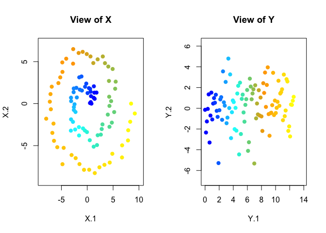
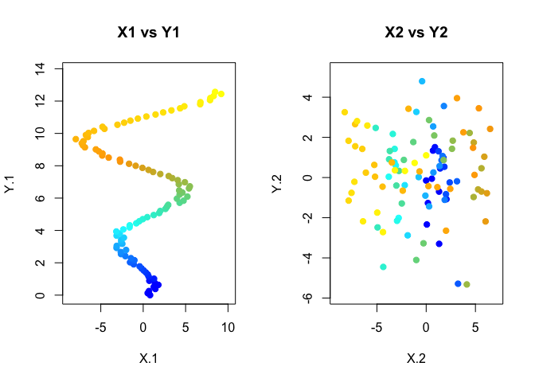
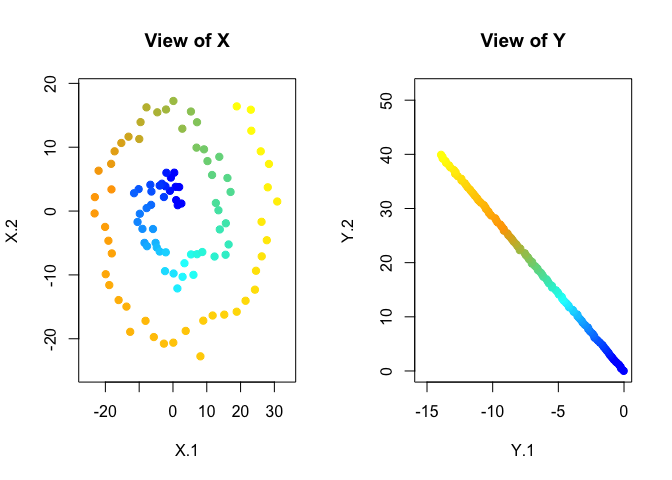
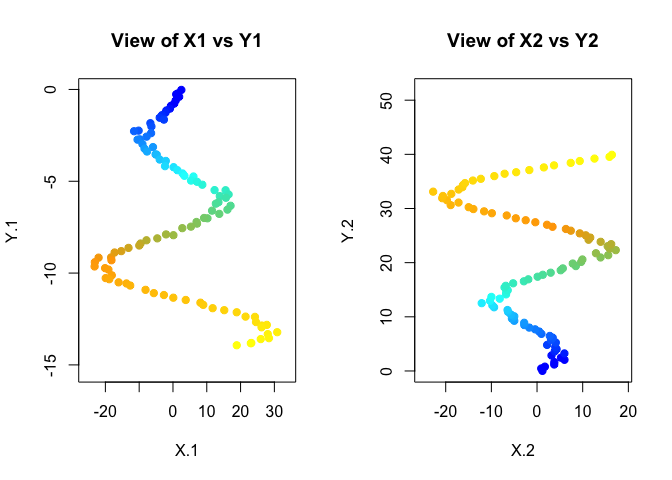
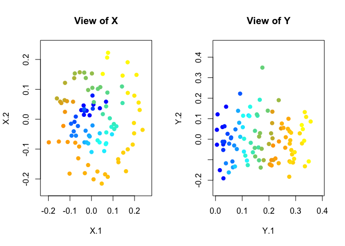
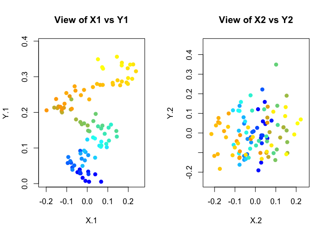
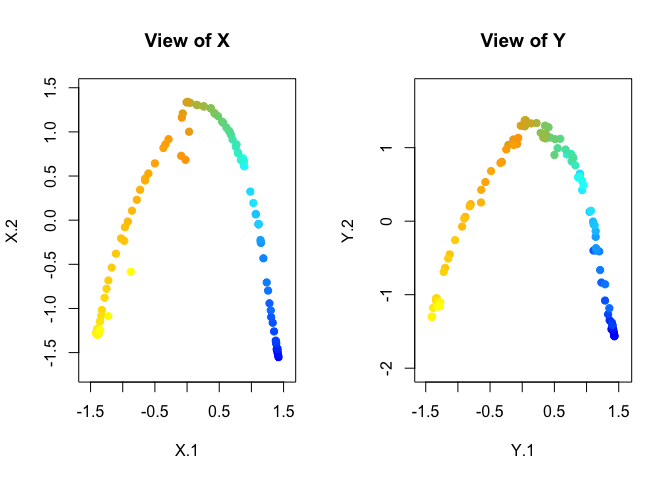
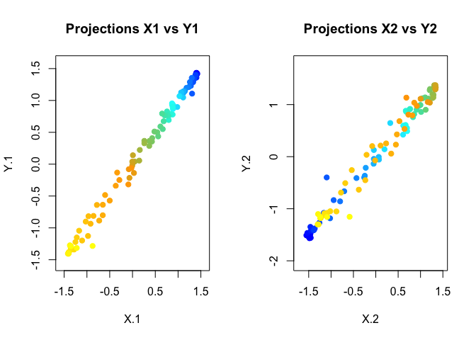
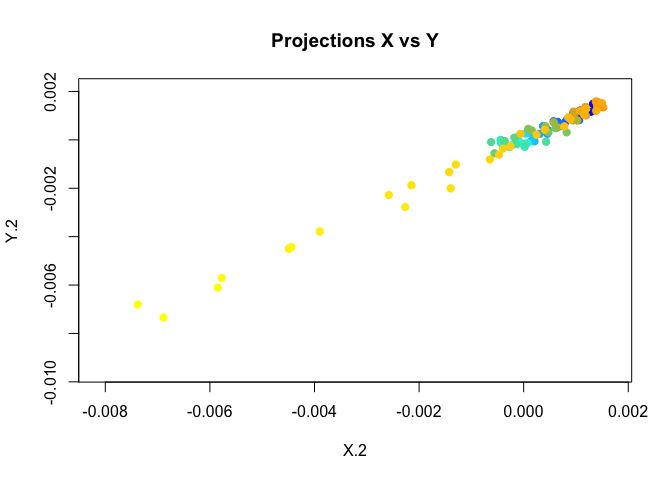

3D to 2D Example
----------------

We try the algorithm on a toy example. First we generate two datasets. We consider here the problem of learning a 2-dimensional projections matrices from a 3-dimensional dataset.

``` r
# dimension of the input features space
q <- 3
# dimension of the output transformed features
d <- 2
# Overal number of examples (train+test)
N <- 100
### Generate data 
MaxAngle <- 4*pi
MinRadius <-0.3
MaxRadius <- 8
sx <- 0.5
sy <- 0.5
set.seed(1244)
t <- seq(0, MaxAngle, length.out = N)
r <- seq(MinRadius, MaxRadius, length.out = N) + 2*runif(N)
#### generate X, the noise can be added!
set.seed(123)
X <- cbind(r*cos(t+0*rnorm(N)*0.05),r*sin(t+0*rnorm(N)*0.05),rnorm(N))
#### generate Y, the noise can be added!
Y <- cbind(t+0*rnorm(N)*1, 2*rnorm(N),rnorm(N))
```

We plot only the first two dimensions (the third dimension is basically noise)



And we can plot the coordinates of X vs Y



We define a matrix of the distance between Xi and Xj (Yi and Yj) for all the possible combination of elements in X (Y)

``` r
X.pairs <- combn(seq(1:nrow(X)),2)
Y.pairs <- combn(seq(1:nrow(Y)),2)

# Each row correspond to a pair (i,j), columns are the coordinates of the distance xi-xj
X.dist <- X[X.pairs[1,],] - X[X.pairs[2,],]
Y.dist <- Y[Y.pairs[1,],] - Y[Y.pairs[2,],]
```

Then we pass the distance matrices to a batch gradient descent algorithm to find the optimal projection matrices for dataset X and dataset Y

    batch.grad.desc.fun(X.dist, Y.dist, N, dim.out=2,
                        gamma.list= c(0.06,0.05),
                        nexper = 1,
                        maxiter= 200,
                        wd.path= '/Users/ilaria_bonavita/My_project/tSNEcca',
                        ...
                        )

The function returns the two optimal matrices W.opt and Z.opt. We then map the 3-d points into the 2-d space

``` r
  XW <- W.opt%*%t(X)
  YZ <- Z.opt%*%t(Y)
```



We can also plot the coordinates of X vs Y to see what's going on



Comparison with other Canonical Correlation Analysis methods
------------------------------------------------------------

If we apply a simple CCA, we obtain the following results



This is what we obtain if we transform the input dataset with Nonparametric CCA (NCCA) with Gaussian KDE (1d)



We also applied Kernel CCA (KCCA). The plot shows the dataset X against Y projected in the kernel latent space


